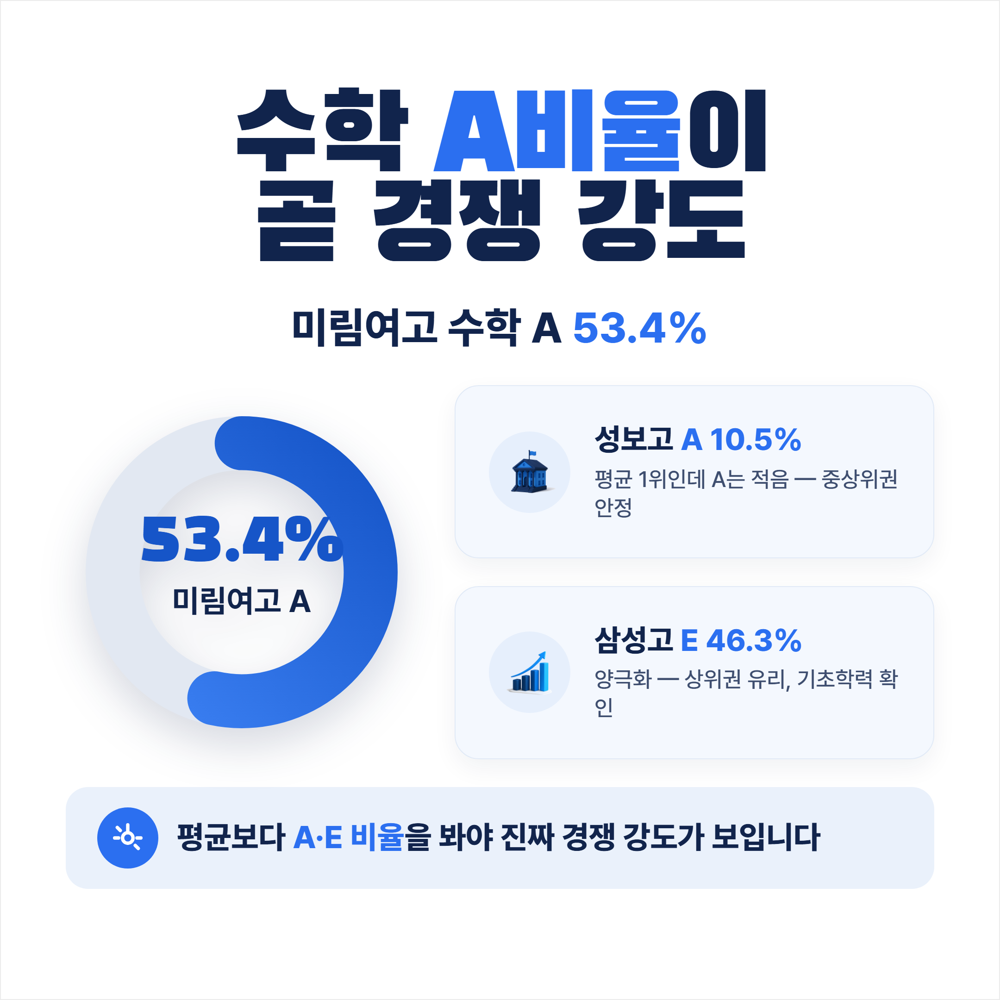
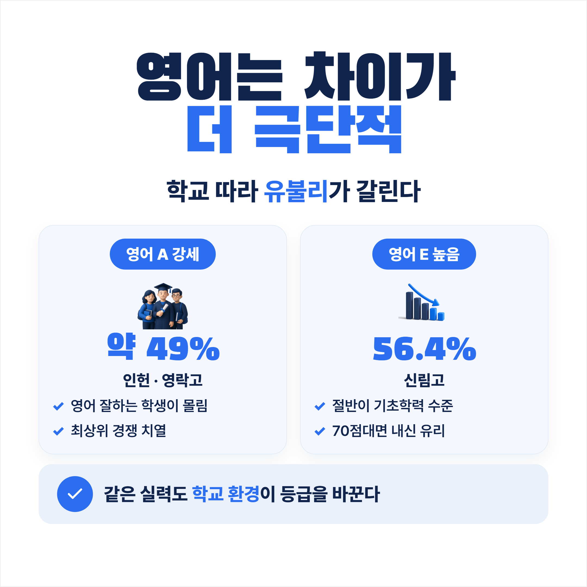

# 관악구 고등학교 내신 경쟁, 학교마다 이렇게 다릅니다 
— 수학·영어 성취도 분석

수학 80점짜리 학생이 A학교에 다니면 2등급, B학교에 다니면 1등급을 받을 수 있습니다. 학교마다 같은 점수를 받는 학생의 비율이 다르기 때문입니다.

관악구 11개교 학생들이 실제로 어떤 점수대에 몰려 있는지, 학교알리미 공시 데이터를 통해 직접 분석했습니다.

## 이 분석의 기준과 한계 먼저 말씀드립니다

이 글의 수치는 **학교알리미 공시 데이터(2023학년도 1학년 기준)** 입니다. 2025학년도 입학생(현재 고2)부터 2022 개정 교육과정이 전면 적용되어 내신 등급 체계가 9등급에서 5등급으로 바뀌었습니다. 이 데이터는 구체제(9등급) 기준이지만, **학교별로 수학·영어 잘하는 학생이 얼마나 많은지라는 특성 자체는 크게 바뀌지 않습니다.**

A비율(성취도 A, 상위권)이 높은 학교일수록 내신 경쟁이 치열하고, E비율이 높으면 기초학력 미달 비율이 높다는 의미입니다.

## 수학 내신 경쟁도 — A비율이 곧 경쟁 강도

평균보다 중요한 게 A비율입니다. A등급 학생이 많을수록, 내 아이가 A를 받기 위해 넘어서야 할 경쟁자가 많습니다.

- **미림여고 수학 A비율 53.4%** — 전교생 절반 이상이 수학 최상위권. 미적분Ⅰ이 전교생 필수인 만큼 수학 강자에겐 최적, 약점인 학생에겐 불리합니다.
- **성보고** — 수학 평균(72.8점)은 가장 높지만 A비율(10.5%)은 낮습니다. 70~80점대 중상위권이 내신을 안정적으로 관리하기 좋은 구조입니다.
- **삼성고** — A비율(18.8%)은 중간이지만 E비율(46.3%)이 관악구 최고 수준으로, 양극화가 뚜렷합니다.

## 영어 내신 경쟁도 — 차이가 더 극단적

영어는 수학보다 학교 간 차이가 더 극단적으로 갈립니다.

- **인헌고·영락고 영어 A비율 약 49%** — 관악구 1·2위. 영어 강자가 모이는 학교라 경쟁이 치열합니다.
- **신림고 영어 E비율 56.4%** — 학교 내 절반 이상이 기초학력 수준. 영어 70점대 이상이면 내신에서 상대적으로 유리합니다.

같은 실력이라도 학교 환경에 따라 받을 수 있는 등급이 달라진다는 점, 꼭 기억하셔야 합니다.

## 두 과목 종합 — 학생 유형별 유리한 학교

- **수학·영어 모두 강점**: 미림여고·영락고·인헌고에서도 경쟁력 유지. 단 A비율이 높아 내신은 빡빡합니다.
- **수학 강점·영어 중간**: 광신고, 당곡고 고려.
- **영어 강점·수학 중간**: 문영여고, 광신고 검토.
- **중위권 안정 관리**: 당곡고, 광신고가 상대적으로 균형적입니다.

## 성취도 데이터, 이렇게 활용하세요

이 수치는 **내신 경쟁 강도의 경향성**을 보여줄 뿐, 합격 보장 기준이 아닙니다. 매년 신입생 구성이 달라지고, 2025학년도부터 5등급제가 적용되며 등급 산출 방식도 바뀌었습니다. 성취도 외에 선택과목 구성, 세특 관리, 진학 지도 시스템도 함께 살펴야 합니다.

다음 편에서는 관악구 고등학교별 **선택과목 구성**이 2028 대입에서 왜 중요한지를 다룹니다.

---

탐구보고서·생기부·수시정시까지, 자녀 성적으로 어느 학교 내신 환경이 유리한지 생각탐구가 데이터로 함께 찾아드립니다.

- 📘 최신 입시 분석자료·수업: [생각탐구 블로그](https://blog.naver.com/yylab)
- 💬 상담 및 수업 문의: [카카오톡 오픈채팅](https://open.kakao.com/o/sjRc4Keh)

`#탐구보고서 #수행평가대비 #독서와탐구 #생기부컨설팅 #수시정시컨설팅`

*성취도 데이터: 학교알리미 공시 자료(2023학년도 1학년 기준) 직접 수집·분석.*
